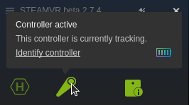

# Headset-free teleoperation of xArm6 with HTC Vive Controller

This repository contains code for VR teleoperation of an xArm6 robot using just an HTC Vive Controller. It uses the OpenVR API to access controller data. Joint angles are calculated to match the robot end-effector pose to the controller pose. The joint angles are applied to xArm6 using a [custom wrapper](https://github.com/ExistentialRobotics/erl_xArm) over the xArm Python SDK.

## Setup
1. Basic Steam setup for Vive with Ubuntu: SteamVR
      - https://github.com/ankurhanda/HTC-Vive-Setup-Ubuntu
      - Do not need to follow entire instructions from here as we are aiming for a headset-free setup
      - No need to install OpenVR from source as per this page. pip install is enough.  

2. SteamVR setup for headset-free operation
      - https://github.com/username223/SteamVRNoHeadset
      - Follow these instructions and modify SteamVR config file every time SteamVR is updated
      - The steam directory on Linux is ~/.steam/steam or ~/.local/share/Steam

Other relevant setup information:
* https://www.youtube.com/watch?v=lu7Hwn-5P-k
* https://github.com/cntools/libsurvive

## Usage
1. Check SteamVR setup and controller detection:
      - Start SteamVR and test if controller is detected. The controller should be visible in the SteamVR status window:

      - Note that the controller needs to be more than ~1 meter away from the base stations to be detected.
2. Test OpenVR installation and controller tracking: 
      - Run `python vr_test.py` to test if controller data is being received correctly. A live plot of the controller pose and position should show up.
3. Test teleoperation:
      - Note: Please install the xArm SDK and ensure that the custom wrapper from the erl_xArm repo is also present on the machine.
      - Run `python robot_control.py` to start teleoperation. The `simulated` parameter is set to `True` by default, so you can verify that the robot is moving correctly in the xArm Studio simulation. If the test is succesful and looks safe, set `simulated` to `False` to control the real robot.
4. Teleoperation legend: 
      - The trigger on the back of the controller is used to open and close the gripper.
      - The menu button is used to end teleoperation easily.
